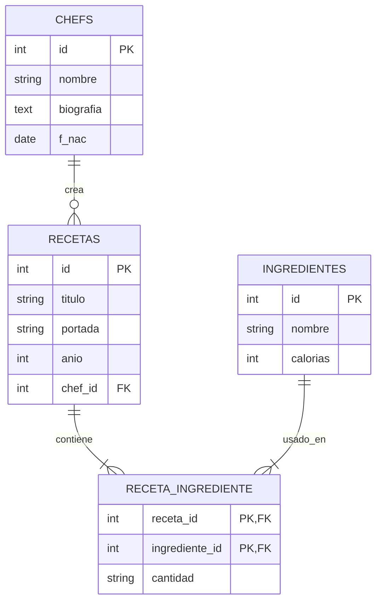

# Chef Digital - Catálogo de Recetas Gourmet 🍳💻

[](https://www.php.net/)
[](https://www.mysql.com/)
[](#-características-clave)

**Chef Digital** es una aplicación web responsiva diseñada como catálogo de recetas gourmet de alta cocina. Cumple con los requisitos académicos de programación en entorno servidor y cuenta con estándares profesionales de arquitectura, seguridad y UI/UX, ideal para presentarse en un portafolio de desarrollo de software de alto nivel.

---

## 🚀 Características Clave

- **Arquitectura Modular (DRY)**: Código limpio y desacoplado estructurado en `/config`, `/includes`, `/assets` y el directorio raíz.
- **Base de Datos Normalizada (3FN)**: Relaciones sólidas de uno a muchos y muchos a muchos, resolviendo eficientemente la asociación entre recetas, chefs e ingredientes.
- **Seguridad Garantizada**: Implementación de **Sentencias Preparadas (Prepared Statements)** mediante PDO para anular cualquier vector de ataque por inyección SQL.
- **Diseño de Interfaz Premium**: Interfaz en modo oscuro con estética híbrida *Glassmorphism*, transiciones animadas fluidas, y enfoque Mobile-First.
- **Accesibilidad Web (A11y)**: Jerarquía estructurada de títulos (H1-H6), textos descriptivos alternativos en portadas de recetas, y compatibilidad con navegadores/lectores de pantalla.

---

## 🛠️ Requisitos Técnicos

- Servidor local compatible con PHP 8.0 o superior (XAMPP, WampServer, Laragon, o Docker).
- Servidor de base de datos MySQL / MariaDB.
- Extensión `pdo_mysql` habilitada en PHP.

---

## 📥 Instrucciones de Instalación

1. **Clonar el proyecto** en tu directorio web (ej. `htdocs` en XAMPP o `www` en Wamp):

   ```bash
   git clone https://github.com/tu-usuario/chef_digital.git
   ```

2. **Configurar la Base de Datos**:
   - Accede a tu administrador de base de datos (phpMyAdmin o CLI).
   - Importa el archivo [`chef_digital.sql`](chef_digital.sql) ubicado en la raíz del proyecto. Este creará la base de datos `chef_digital` e insertará registros de prueba automatizados.

3. **Verificar Conexión en el Backend**:
   - Edita el archivo de configuración [`config/db.php`](config/db.php) si tu servidor MySQL utiliza un puerto, usuario o contraseña diferente.

     ```php
     define('DB_USER', 'tu_usuario');
     define('DB_PASS', 'tu_contrasena');
     ```

4. **Correr Localmente**:
   - Abre tu navegador web y navega a `http://localhost/chef_digital/index.php`.

---

## 🌐 Despliegue en Servidor Gratuito (InfinityFree)

Este proyecto es compatible con servicios de hosting compartido tradicionales como **InfinityFree** de forma totalmente gratuita.

### 1. Preparar la Base de Datos en cPanel
- Regístrate o inicia sesión en [InfinityFree](https://infinityfree.com/) y crea una cuenta de hosting.
- Entra al panel de control (cPanel / VistaPanel) y haz clic en **MySQL Databases**.
- Crea una nueva base de datos. InfinityFree le asignará automáticamente un prefijo basado en tu cuenta (ejemplo: `if0_3628318_chef_digital`).
- Toma nota de tus credenciales que se muestran en el panel:
  - **MySQL Hostname**: (ejemplo: `sql203.infinityfree.com`)
  - **MySQL Username**: (ejemplo: `if0_3628318`)
  - **MySQL Password**: (la contraseña de tu cuenta de cPanel)
- Entra a **phpMyAdmin** desde el panel, selecciona la base de datos recién creada e importa el archivo [`chef_digital.sql`](chef_digital.sql).

### 2. Configurar el Backend para Producción
- Abre el archivo [`config/db.php`](config/db.php) y localiza la sección de **Configuración Manual** en la parte superior.
- Reemplaza los valores por defecto con tus credenciales de InfinityFree:
  ```php
  define('CONF_DB_HOST', 'sql203.infinityfree.com'); // Tu Hostname de MySQL
  define('CONF_DB_USER', 'if0_3628318');             // Tu Username
  define('CONF_DB_PASS', 'tu_contraseña_cpanel');    // Tu Password
  define('CONF_DB_NAME', 'if0_3628318_chef_digital'); // Tu Nombre de BD
  ```

### 3. Subir los Archivos mediante FTP o File Manager
- Entra al **Online File Manager** de InfinityFree o conéctate vía FTP (usando herramientas como FileZilla).
- Sube todo el contenido del proyecto (incluyendo la carpeta `config`, `includes`, `assets` y los archivos `.php`) dentro del directorio **`htdocs/`**.
- Una vez finalizada la subida, accede al dominio asignado por InfinityFree (ejemplo: `http://tu-sitio.infinityfreeapp.com`) para ver tu catálogo Chef Digital en funcionamiento.

---

## 📊 Diseño de la Base de Datos (E-R Diagram)

El esquema de base de datos está normalizado para optimizar consultas relacionales complejas y mantener la integridad de los datos.



---

## 🔒 Seguridad: Mitigación de SQL Injection

En este proyecto se ha implementado seguridad por diseño mediante el uso de **PDO** (PHP Data Objects) con sentencias preparadas.

### ¿Por qué es seguro?

Al concatenar variables del usuario en un string SQL, un atacante puede inyectar código malicioso para alterar la lógica de la base de datos.
Al utilizar `PDO::prepare()` y vincular parámetros con `bindParam()`:

1. **Precompilación**: La base de datos compila la estructura de la consulta antes de recibir los valores reales.
2. **Tratamiento como cadenas literales**: Los parámetros del usuario se envían por canales de datos separados, obligando al motor SQL a interpretarlos estrictamente como strings de texto y nunca como comandos ejecutables.

*Ejemplo práctico implementado en [`includes/funciones.php`](includes/funciones.php):*

```php
$stmt = $db->prepare("SELECT * FROM recetas WHERE id = :id");
$stmt->bindParam(':id', $id, PDO::PARAM_INT);
$stmt->execute();
```

---

## 🎨 Sugerencias para un Portafolio de Alto Nivel

Si vas a presentar este proyecto ante reclutadores o en tu web de portafolio, considera las siguientes pautas de documentación:

1. **Añade capturas de pantalla / GIFs de la UI**: Muestra el diseño adaptable en móvil y escritorio.
2. **Describe las Heurísticas de Nielsen aplicadas**:
   - *Visibilidad del estado del sistema*: Búsquedas dinámicas y pantallas claras de "No se encontraron resultados".
   - *Prevención de errores*: Validación estricta del parámetro `id` en `receta.php` (redireccionando en caso de datos no válidos).
   - *Estética y diseño minimalista*: Uso equilibrado de tipografía y colores que no saturan al usuario.
3. **Explica la escalabilidad**: Menciona cómo el uso de la arquitectura modular (DRY) facilita añadir funcionalidades futuras (como paneles de administración para añadir recetas o registro de usuarios) con mínimo esfuerzo de refactorización.
